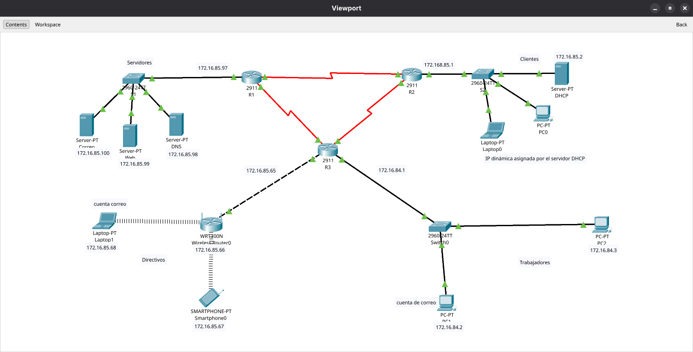
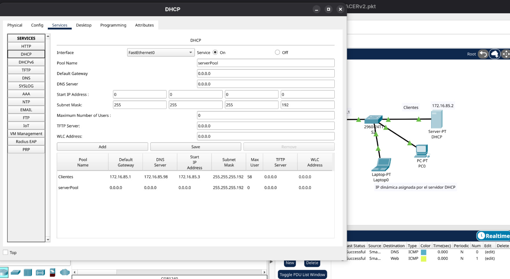
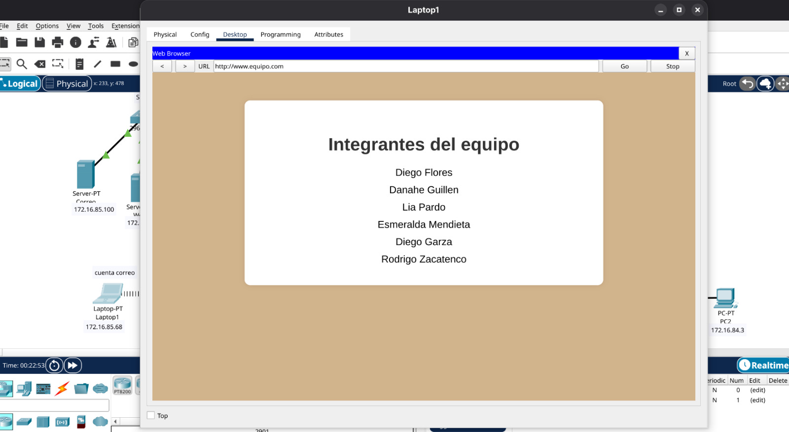
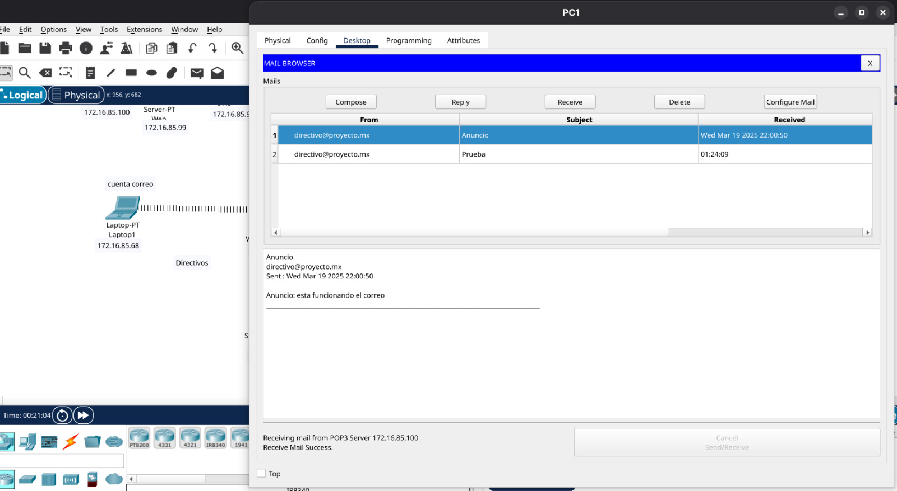

# packet-tracer-pharmacy-network
Enterprise network simulation for a pharmaceutical branch developed in Cisco Packet Tracer.

# Pharmaceutical Branch Network Simulation

Enterprise network design and simulation developed in **Cisco Packet Tracer** as a final project for the Fundamentals of Networks course.

The project simulates the network infrastructure of a new pharmaceutical branch, including departmental segmentation, dynamic routing, automatic IP assignment and essential enterprise services.

> Academic team project developed at Universidad Autónoma de Nuevo León.



## Project Overview

The objective was to design a functional, scalable and segmented network for a pharmaceutical branch.

The network was divided into the following areas:

- Employees
- Customers
- Management
- Servers

A 20% growth margin was considered when calculating the required address space for each segment.

## Main Features

- IPv4 addressing and VLSM subnetting
- Network segmentation by department
- Three interconnected Cisco routers
- Cisco 2960 switches
- RIP version 2 dynamic routing
- DHCP service for customer devices
- Internal DNS service
- HTTP web server
- Internal email server
- WPA2-protected wireless network for management
- Connectivity tests between all network segments

## Network Addressing

| Segment    | Network           | Host Range                     | Broadcast       | Subnet Mask       |
|    ---     |        ---        |             ---                |       ---       |         ---       |
| Employees  | `172.16.84.0/24`  | `172.16.84.1 - 172.16.84.254`  | `172.16.84.255` | `255.255.255.0`   |
| Customers  | `172.16.85.0/26`  | `172.16.85.1 - 172.16.85.62`   | `172.16.85.63`  | `255.255.255.192` |
| Management | `172.16.85.64/27` | `172.16.85.65 - 172.16.85.94`  | `172.16.85.95`  | `255.255.255.224` |
| Servers    | `172.16.85.96/27` | `172.16.85.97 - 172.16.85.126` | `172.16.85.127` | `255.255.255.224` |

## Router Interconnections

| Connection | Network          | Addresses                             |
|     ---    |        ---       |                 ---                   |
| R1 ↔ R2    | `192.168.1.0/30` | R1: `192.168.1.1`, R2: `192.168.1.2`  |
| R2 ↔ R3    | `192.168.1.4/30` | R2: `192.168.1.5`, R3: `192.168.1.6`  |
| R1 ↔ R3    | `192.168.1.8/30` | R1: `192.168.1.9`, R3: `192.168.1.10` |

## Implemented Services

### DHCP

A DHCP server was configured for the customer network to automatically provide:

- IP address
- Subnet mask
- Default gateway
- DNS server address

### DNS and Web Server

The internal DNS server resolves:

```text
www.equipo.com
```

The domain points to an internal HTTP server containing a demonstration website.

### Email Server

An internal mail server was configured using the domain:

```text
@proyecto.mx
```

The service was tested by sending messages between management and employee devices.

### Dynamic Routing

RIP version 2 was configured on all routers to exchange routes between the different networks.

Example configuration:

```text
router rip
 version 2
 no auto-summary
 network 172.16.84.0
 network 172.16.85.0
 network 192.168.1.0
```

## Validation Tests

The following tests were completed successfully:

- Automatic address assignment through DHCP
- Connectivity between separate subnets
- RIP v2 route propagation
- DNS name resolution
- Access to the internal website
- Internal email delivery
- Wireless connectivity using WPA2 security

## Screenshots

### Complete Network Topology


### DHCP Test



### DNS and Web Server Test



### Email Connectivity Test



## Repository Contents

- [`packet-tracer/`](packet-tracer/) — Cisco Packet Tracer `.pkt` simulation.
- [`documentation/`](documentation/) — Technical project documentation.
- [`screenshots/`](screenshots/) — Evidence of the implemented topology and tests.

## My Contributions

This project was developed collaboratively. My main contributions were:

- Configuring dynamic routing between the three routers using RIP version 2.
- Advertising the internal subnets and router interconnection networks.
- Verifying learned routes using commands such as `show ip route` and `show ip protocols`.
- Testing connectivity between the different network segments using `ping`.
- Supporting the configuration of the DHCP service for the customer network.
- Assisting with the definition of the DHCP address pool, default gateway, subnet mask and DNS server.
- Troubleshooting routing and connectivity issues during the simulation.

## Individual Laboratory Extension

After completing the collaborative network design, I reused the same base topology
for an individual laboratory project. This version focused on device administration,
basic security and remote access configuration.

The additional configurations included:

- Assigning descriptive hostnames to routers and switches.
- Configuring console access on network devices.
- Protecting console sessions with passwords.
- Configuring `enable secret` for privileged EXEC access.
- Adding a Message of the Day banner for unauthorized-access warnings.
- Enabling `service password-encryption`.
- Assigning management IP addresses to switches.
- Configuring remote device administration through Telnet.
- Verifying access and connectivity from a management workstation.

This extension allowed me to practice not only network routing and services, but also
the initial configuration and administration of Cisco infrastructure.

## Project Versions

| Version | Type | Main Focus |
|---|---|---|
| Base Network Project | Collaborative | VLSM, RIP v2, DHCP, DNS, HTTP, email and wireless connectivity |
| Laboratory Extension | Individual | Hostnames, console security, password encryption, MOTD, switch management and Telnet |

## Skills Demonstrated

- Cisco Packet Tracer
- Network topology design
- IPv4 addressing
- Subnetting and VLSM
- RIP v2 dynamic routing
- Cisco IOS configuration
- Router and switch configuration
- DHCP configuration
- DNS and HTTP services
- Wireless network security
- Console and remote device access
- Network troubleshooting
- Connectivity testing
- Technical documentation
- Team collaboration
- Individual network implementation

## How to Open the Project

1. Install Cisco Packet Tracer.
2. Download the `.pkt` file from the `packet-tracer` folder.
3. Open the file in Cisco Packet Tracer.
4. Wait for the network interfaces to initialize.
5. Test connectivity using `ping`, the web browser and the email clients.

## Academic Context

Final project for the **Fundamentals of Networks** course at Universidad Autónoma de Nuevo León.

This repository is intended for educational and portfolio purposes.
